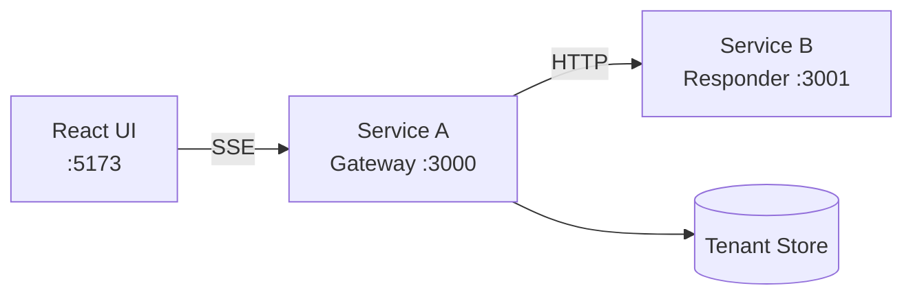

# MiniChat v2

A microservices-based chat application demonstrating SSE streaming, multi-tenant architecture, and pluggable chat engines.


## Architecture



## Features

### Service A - Gateway (Port 3000)

- Multi-tenant support via `X-Tenant-Id` header
- SSE streaming with chunked responses
- In-memory per-tenant conversation history
- Orchestrates calls to Service B

### Service B - Responder (Port 3001)

- Pluggable ChatEngine architecture
- **EchoEngine**: Echoes input with transformations
- **RuleBasedEngine**: Keyword matching with fallback
- Slow mode for chunking demonstration

### UI (Port 5173)

- Real-time SSE streaming
- i18n support (English/Spanish/Hebrew)
- Dark amber theme with glassmorphism
- Debug corner showing tenant info
- Typing indicator during streaming

## Quick Start

### Docker (Recommended - Single Command)

The easiest way to run the entire stack:

```bash
docker compose up --build
```

This starts all three services:

- **UI**: <http://localhost:5173>
- **Gateway API**: <http://localhost:3000>
- **Responder**: <http://localhost:3001>

To run with the RuleBased engine:

```bash
ENGINE=rulebased docker compose up --build
```

To stop all services:

```bash
docker compose down
```

---

### Manual Setup (Development)

#### Prerequisites

- Node.js 18+
- npm or pnpm

#### 1. Start Service B (Responder)

```bash
cd service-b-responder
npm install
npm run dev
```

Server will start on <http://localhost:3001>

#### 2. Start Service A (Gateway)

```bash
cd service-a-gateway
npm install
npm run dev
```

Server will start on <http://localhost:3000>

#### 3. Start the UI

```bash
cd ui
npm install
npm run dev
```

UI will be available at <http://localhost:5173>

## API Reference

### Service A - Gateway

#### POST /api/v2/chat

Send a message for processing.

```bash
curl -X POST http://localhost:3000/api/v2/chat \
  -H "Content-Type: application/json" \
  -H "X-Tenant-Id: my-tenant" \
  -d '{"message": "Hello, world!"}'
```

Response: `202 Accepted`

```json
{
  "accepted": true,
  "message": "Message received. Use /api/v2/chat/stream to get the response."
}
```

#### GET /api/v2/chat/stream

Stream a response via SSE.

```bash
curl -N http://localhost:3000/api/v2/chat/stream?msg=Hello \
  -H "X-Tenant-Id: my-tenant"
```

Response: `text/event-stream`

```text
event: chunk
data: "Echo: "

event: chunk
data: "\"Hello\""

event: done
data: {"engine":"EchoEngine","totalLength":18,"chunkCount":2}
```

Query parameters:

- `msg` (required): The message to process
- `mode` (optional): `slow` for longer responses

#### GET /api/v2/debug/state

Get tenant conversation history.

```bash
curl http://localhost:3000/api/v2/debug/state \
  -H "X-Tenant-Id: my-tenant"
```

### Service B - Responder

#### POST /respond

Generate a response.

```bash
curl -X POST http://localhost:3001/respond \
  -H "Content-Type: application/json" \
  -d '{"message": "Hello", "tenantId": "my-tenant", "mode": "fast"}'
```

Response:

```json
{
  "reply": "Hello there! How can I help you today?",
  "engine": "RuleBasedEngine",
  "timestamp": "2024-01-15T10:30:00.000Z"
}
```

## Configuration

### Service A (.env)

```ini
PORT=3000
RESPONDER_URL=http://localhost:3001
CHUNK_SIZE=50
CHUNK_DELAY_MS=100
```

### Service B (.env)

```ini
PORT=3001
ENGINE=echo
```

### UI (.env)

```ini
VITE_API_URL=http://localhost:3000
```

## UI Design

The UI features a distinctive dark theme with:

- **Colors**: Charcoal background (`#0a0a0b`) with amber accents (`#f59e0b`)
- **Typography**: JetBrains Mono for code, Outfit for UI text
- **Effects**: Glassmorphism on chat window, grid pattern background
- **Animations**: Smooth message transitions, typing dots, blinking cursor

## Development

### Project Structure

```text
minichat-v2/
├── service-a-gateway/
│   ├── src/
│   │   ├── middleware/tenant.ts
│   │   ├── routes/chat.ts
│   │   ├── services/
│   │   │   ├── chunker.ts
│   │   │   └── responderClient.ts
│   │   ├── store/tenantStore.ts
│   │   ├── types/index.ts
│   │   └── server.ts
│   ├── Dockerfile
│   └── package.json
├── service-b-responder/
│   ├── src/
│   │   ├── engines/
│   │   │   ├── ChatEngine.ts
│   │   │   ├── EchoEngine.ts
│   │   │   └── RuleBasedEngine.ts
│   │   └── server.ts
│   ├── Dockerfile
│   └── package.json
├── ui/
│   ├── src/
│   │   ├── components/
│   │   │   ├── ChatWindow.tsx
│   │   │   ├── DebugCorner.tsx
│   │   │   ├── LanguageToggle.tsx
│   │   │   ├── MessageItem.tsx
│   │   │   └── TypingIndicator.tsx
│   │   ├── i18n/
│   │   │   ├── en.ts
│   │   │   ├── es.ts
│   │   │   └── index.tsx
│   │   ├── App.tsx
│   │   └── index.css
│   ├── Dockerfile
│   └── package.json
├── docker-compose.yml
└── README.md
```

### Switching Engines

To use the Echo engine instead of RuleBased:

```bash
# In service-b-responder/.env
ENGINE=echo
```

Or with Docker:

```bash
ENGINE=rulebased docker compose up --build
```

### Adding a New Engine

1. Create a new file in `service-b-responder/src/engines/`:

```typescript
import { ChatEngine } from './ChatEngine.js';

export class MyCustomEngine implements ChatEngine {
  readonly name = 'MyCustomEngine';

  async generateReply(message: string, mode?: 'slow' | 'fast'): Promise<string> {
    // Your logic here
    return `Response to: ${message}`;
  }
}
```

2. Register it in `server.ts`:

```typescript
import { MyCustomEngine } from './engines/MyCustomEngine.js';

function createEngine(): ChatEngine {
  switch (ENGINE_TYPE.toLowerCase()) {
    case 'mycustom':
      return new MyCustomEngine();
    // ... other cases
  }
}
```

## Message Model Evolution

The message model has been extended to support optional metadata while maintaining backward compatibility.

### What Changed

The `Message` interface now includes an optional `metadata` field:

```typescript
interface MessageMetadata {
    tags?: string[];
    confidence?: number;
    source?: string;
    [key: string]: unknown; // Extensible
}

interface Message {
    id: string;
    role: 'user' | 'assistant';
    content: string;
    timestamp: string;
    metadata?: MessageMetadata; // Optional
}
```

### Why It's Backward Compatible

1. **Optional field**: The `metadata` field uses TypeScript's optional syntax (`?`), so existing code that doesn't reference it continues to compile and work.

2. **Spread operator pattern**: When creating messages, metadata is only included if provided:
   ```typescript
   const message = {
       id, role, content, timestamp,
       ...(metadata && { metadata })
   };
   ```

3. **No breaking changes**: All existing API consumers, UI components, and storage code that only reads `id`, `role`, `content`, and `timestamp` work unchanged.

4. **Graceful degradation**: When metadata is missing, the system behaves sensibly - it simply doesn't display or process metadata fields.

### Future Extensibility

The `TenantHistory` also includes an optional `settings` field for per-tenant configuration:

```typescript
interface TenantSettings {
    defaultLanguage?: string;
    defaultProvider?: string;
}
```

This allows adding workspace-specific settings (like default chat engine or language) without schema migrations.

